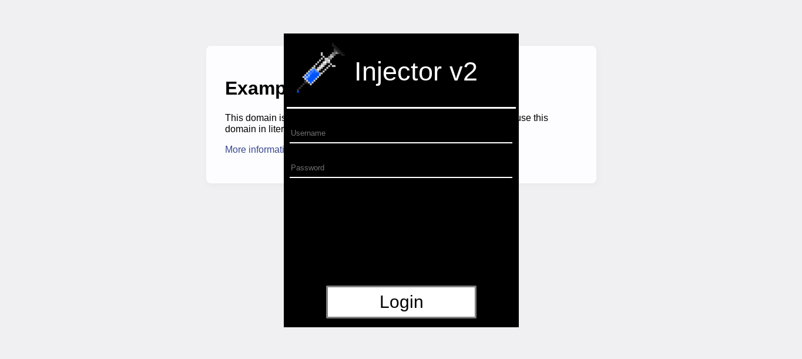

# inject0r
The official repository for Inject0r's backend

*** 

#### What is Injector? 

Injector is a JavaScript bookmark developed by bobthehairman. It creates a pseudo-desktop environment on any page you run it on which has multiple apps for games, proxying, chatting, ect, and it can be hidden at any time by simply pressing Right Shift. Its primary use is to circumvent school security mechanisms like iBoss, GoGuardian, Securly, Harpara, ect.

#### Features

##### Injector's currently included apps are as follows:
      Changelog: Lists most recent update's changes
      Exploit Hub: Basic general use exploits
      Chatbox2: A chatroom to talk to other Injector users, with indicators as to who is on the chatroom
      ProxBrowser: A browser that proxies all sites you put into it, effectively unblocking sites.
      App Store: A place for 3rd party devs to upload apps.
      Personalize: Change the theme of Injector. Saves between sites.

##### App Store 
As mentioned in the Features tab, the App Store is a place for third party developers to upload their own apps. Apps downloaded on the App Store will save cross-site. Apps are not restricted to just windows, either; they can be libraries, themes, you name it. Apps are all verified through official Injector developers to ensure no malicious code is included. If you'd like to upload an app, make a issue and post your app code.

##### Purchase Injector 

Injector is free, and can be gotten if you contact me. Contact me on by raising a request on this github info to get Injector. Download the client from the 
releases tab, please note you need an account to use.

***

